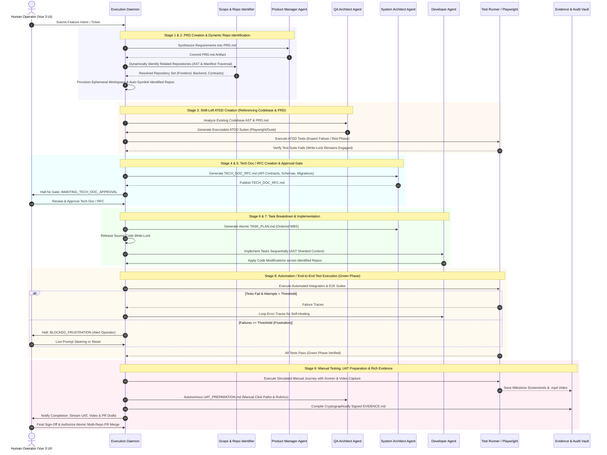

# Product Requirements Document (PRD)

**Document Title:** AI-Driven SDLC Meta-Orchestrator  
**Document ID:** PRD-001  
**Status:** Approved for Architecture & Implementation Planning  
**Document Version:** 5.0  
**Target Milestone:** V1.0 Core Platform & Autonomous Factory  
**Last Updated:** 2026-09-24  

---

## 1. Executive Summary

The **AI-Driven SDLC Meta-Orchestrator** is an autonomous, persistent, event-driven software development factory managed via a real-time Vue 3 frontend and powered by a high-concurrency background execution daemon. It automates end-to-end software development lifecycles across complex, multi-repository architectures by coordinating specialized multi-agent methodologies (BMAD Agile, Supervisor, ReAct, and Superpower).

Operating under a strict **Zero-Trust Software Factory** philosophy, the Meta-Orchestrator enforces Acceptance Test-Driven Development (ATDD) through hard write-locks: developer agents are cryptographically prevented from writing implementation code until automated test suites are committed and proven to fail. Concurrently, the system autonomously produces human-readable User Acceptance Testing manuals (`UAT_PREPARATION.md`) and rich media records (headful/headless Playwright `.mp4` video recordings and UI screenshots). Every merged pull request is backed by a signed `EVIDENCE.md` audit trail.

To prevent runaway token expenditure and context window degradation, the orchestrator employs AST-based context sharding, artifact-driven state communication, and dynamic, cost-tiered model routing with integrated shadow benchmarking.

---

## 2. Strategic Objectives & Core Tenets

* **Persistent, Resilient Autonomy:** Long-running SDLC tasks (Docker builds, package installations, multi-suite test runs) execute via an asynchronous event daemon (Go / Redis BullMQ), fully decoupled from the UI thread with state serialization and crash-recovery.
* **Full-Spectrum "Shift-Left" Quality Assurance:** Invert traditional development by generating executable E2E/integration tests and manual human test scripts prior to implementation. Source modifications remain programmatically locked until tests fail.
* **Multi-Repository Orchestration:** Automate the dynamic cloning, AST inspection, and dependency symlinking of coupled frontend, backend, and testing repositories inside isolated Docker Compose environments.
* **Context Efficiency & Cost Governance:** Eliminate context bloat through AST-targeted code sharding, artifact-driven Markdown memory exchanges, and tier-based model routing (reserving frontier reasoning models for architecture while offloading log analysis and synthesis to lightweight models).
* **Continuous Self-Optimizing Telemetry:** Capture granular Token-Per-Feature (TPF) consumption, Time-to-Resolution (TTR), and pass rates; feed empirical metrics back into a dynamic router while executing background shadow benchmarks to discover optimal orchestration paths.
* **Total Human-In-The-Loop (HITL) Observability:** Stream live agent thoughts, terminal bash logs (`xterm.js`), and ephemeral workspace topologies over low-latency WebSockets with granular manual injection and emergency volume purge controls.

---

## 3. Core System Architecture & Detailed Feature Specifications

The Meta-Orchestrator is structured across seven (7) primary architectural pillars:

```
┌─────────────────────────────────────────────────────────────────────────────┐
│                       6. Frontend Observability (Vue 3 UI)                  │
│   [Mission Control]   [Live Agent Terminal]   [Workspace Graph]   [Vault]   │
└──────────────────────────────────────┬──────────────────────────────────────┘
                                       │ WebSockets / REST
┌──────────────────────────────────────▼──────────────────────────────────────┐
│                    5. Background Execution Daemon (Go / Redis)               │
│   [Async Event Loop]   [State Engine & Resumption]   [Anti-Loop Breaker]    │
└──────────────┬───────────────────────┬───────────────────────┬──────────────┘
               │                       │                       │
┌──────────────▼─────────────┐ ┌───────▼─────────────────┐ ┌───▼──────────────┐
│ 1. AI Routing Core         │ │ 2. Modular Registries   │ │ 3. Multi-Repo    │
│ • Task Profiler            │ │ • Profile Registry      │ │    Workspace     │
│ • Method Router            │ │ • Skill Registry        │ │ • Ephemeral Sand │
│ • AST Context Sharding     │ │ • Prompt Registry       │ │ • Auto-Symlinking│
│ • Artifact-Driven Memory   │ │ • Method Registry       │ │ • Cross-Repo Git │
│ • Cost-Optimized Routing   │ └─────────────────────────┘ └──────────────────┘
└──────────────┬─────────────┘
               │
┌──────────────▼──────────────────────────────────────────────────────────────┐
│ 4. "Shift-Left" QA & Rich Media Evidence Engine                             │
│ • ATDD Test Suite   • Write-Locking   • UAT Manual   • Video/Screenshots    │
└──────────────────────────────────────┬──────────────────────────────────────┘
                                       │
┌──────────────────────────────────────▼──────────────────────────────────────┐
│ 7. Continuous Benchmarking & Telemetry                                       │
│ • TPF & TTR Metrics   • Router Feedback Loop   • Shadow Benchmarking Engine  │
└─────────────────────────────────────────────────────────────────────────────┘
```

---

### Pillar 1: The AI Routing & Intelligence Core

1. **Dynamic Task Profiler:**
   * Intercepts incoming tickets, PR descriptions, or feature prompts.
   * Performs technical scope classification: calculates AST impact radius, estimated dependency tree traversal depth, context token budget, and required container services.
   * Produces a structured `TaskProfile` object specifying constraints, timeouts, and resource allocations.

2. **Intelligent Method Router & Granular Complexity Matcher:**
   * Dynamically maps each SDLC stage and individual subtask to the optimal multi-agent execution framework based on empirical benchmarks and technical complexity:
     * **Granular Stage-by-Stage Matching:** The system does not lock an entire lifecycle into a single monolithic method. Instead, it dispatches optimal methods per phase:
       - **PRD & Architecture (Stages 1–4):** Best with **BMAD (Agile Methodology)** for structured sequential rigor (`PM → QA Architect → System Architect`).
       - **Cross-Stack Coordination (Stage 7):** Best with **Supervisor** for synchronized, parallel frontend (Vue 3) and backend subagents.
       - **Task Implementation (Per-Task Complexity Slicing):** Assessed dynamically per atomic task:
         * *Low Complexity* (isolated function change, CSS/UI tweak, single-file bugfix): Best with **ReAct** (rapid single-agent tool execution loop with minimal token overhead).
         * *Medium Complexity* (modular feature in single repo, DB migration + repository pattern): Best with **BMAD Developer Agent**.
         * *High / Cross-Stack Complexity* (multi-repo API contract change, frontend + backend synchronization): Best with **Supervisor**.
         * *System & Infrastructure Refactoring* (Docker Compose overhaul, CI/CD pipelines, root migrations): Best with **Superpower** (unrestricted plan-and-execute loop).
     * **Continuous Benchmarking Feedback:** The router continually pulls empirical pass-rate and token-efficiency data from Pillar 7 to assign the proven "best fit" method for each task type.

3. **AST-Based Context Sharding:**
   * Prevents LLM context saturation and hallucinations by indexing codebases via Language Server Protocol (LSP) and Abstract Syntax Tree (AST) parsers (e.g., Tree-sitter, PHP-Parser, TypeScript Compiler API).
   * Extracts only targeted class definitions, method signatures, route definitions, and related interfaces instead of dumping entire source files.
   * Feeds pinpoint localized context slices to the model with bi-directional reference pointers.

4. **Artifact-Driven Memory Protocol:**
   * Strictly decouples inter-agent communication from chat history to avoid context window degradation.
   * Agents communicate exclusively through standardized, version-controlled markdown artifacts stored in `.sdlc/artifacts/{task_id}/`:
     * `TASK_SPEC.md`: Clarified technical specification.
     * `ARCHITECTURE.md`: Database migrations, API schemas, and contracts.
     * `ATDD_SUITE.md`: Formal acceptance criteria and test mapping.
     * `UAT_PREPARATION.md`: Plain-language human verification manual.
     * `EVIDENCE.md`: Cryptographic log of test execution, videos, and commit hashes.

5. **Cost-Optimized Model Routing:**
   * Enforces a multi-tiered LLM routing strategy based on task cognitive load:
     * **Tier 1 (Reasoning / Strategic):** High-capability models (e.g., Claude 3.5 Sonnet, GPT-4o, Gemini 1.5 Pro) reserved exclusively for Task Profiling, System Architecture, and ATDD test design.
     * **Tier 2 (Implementation / Code Gen):** Balanced models (e.g., Claude 3.5 Sonnet, GPT-4o, DeepSeek-Coder) for code writing and test repair.
     * **Tier 3 (Log Parsing / Synthesis / Tool Calls):** High-speed, low-cost models (e.g., Claude 3.5 Haiku, GPT-4o-mini, Gemini 1.5 Flash) for analyzing compiler outputs, container build logs, git diffs, and formatting artifacts.

6. **Multi-Provider AI Abstraction Layer & Cascading Configuration Engine:**
   * **Universal Provider Drivers:** Pluggable adapter architecture normalizing completions, token counting, function/tool-calling, and streaming across leading providers:
     * **Anthropic (Claude):** Claude 3.5 Sonnet, Claude 3.5 Haiku, Claude Opus.
     * **Google / Antigravity:** Gemini 1.5 Pro / Flash, Antigravity API & CLI engines.
     * **OpenAI (ChatGPT):** GPT-4o, GPT-4o-mini, o1, o3, ChatGPT enterprise APIs.
     * **OpenCode & Local Inference:** Ollama, vLLM, DeepSeek-Coder, LocalAI, and arbitrary OpenAI/Anthropic-compatible endpoints.
   * **Hierarchical Cascading Configuration Resolution:**
     * Automatically inspects, parses, and cascades configuration across three hierarchical layers:
       $$\text{Project Config } (\texttt{.sdlc/config.yaml} \text{ or } \texttt{.meta-orchestrator.yaml}) \succ \text{User Web Settings} \succ \text{System Env Vars}$$
     * **Per-Project Customization:** Repositories can commit custom model routing tables, project-specific provider preferences (e.g., forcing OpenCode/Local for private repositories, or Claude 3.5 Sonnet for critical payments repos), custom base URLs, and bespoke temperature/token limits.
     * **Automated System Fallback:** If a project omits custom configurations, the orchestrator automatically inherits global system settings and environment variables (`ANTHROPIC_API_KEY`, `OPENAI_API_KEY`, `ANTIGRAVITY_API_KEY`, `OPENCODE_BASE_URL`).

7. **Dual-Strategy Routing Architecture (Best-Practice Router vs. Custom Router):**
   * Enforces that **every task and every AI request** is dispatched through an explicit, auditable routing strategy:
     * **Strategy A: Best-Practice Router (Default Heuristic & Adaptive):**
       * Leverages pre-tuned, benchmark-proven heuristic policies and empirical leaderboard telemetry.
       * Automatically matches the General AI SDLC stage and cognitive load (e.g. PRD & Architecture -> Tier 1 Reasoning; Implementation -> Tier 2 Code Gen; Log Parsing & Tool Calls -> Tier 3).
       * Optimizes the trade-off curve between first-pass verification rate, token expenditure, and latency without requiring manual tuning.
     * **Strategy B: Custom Router (Declarative Rule Engine):**
       * Enables users and enterprises to declare bespoke routing logic via the Vue 3 UI or in `.sdlc/config.yaml` / `router.json`.
       * Supports rich multi-condition matchers:
         - Repository regex matching (e.g., `repo: "payments-*" → provider: anthropic, model: claude-3-5-sonnet`).
         - File path / language extensions (e.g., `path: "*.sql" → db_specialist_model`).
         - SDLC Stage & Role (e.g., `stage: "ATDD_CREATION" → o1 / claude-3-5-sonnet`).
         - Cost budget caps (e.g., `if task_cost > $2.00 → switch to OpenCode / DeepSeek-Coder local`).
         - Priority tags (e.g., `priority: "urgent" → force Tier 1 reasoning`).
     * **Routing Explainer & Traceability:**
       * Every AI request logs an immutable `RoutingDecision` vector explaining why a specific model, provider, and methodology were assigned (`strategy: "best_practice" | "custom"`, `rule_id`, `reason`), streamed live to UI thought bubbles and archived in `EVIDENCE.md`.

---

### Pillar 2: Modular Registry Architecture

The system operates on an extensible, schema-validated configuration registry accessible via both code and the Vue 3 Control Panel:

1. **Profile Registry (`profiles.json` / Database):**
   * Configures agent personas, bounded system permissions, permitted skills, and model assignments.
   * Example: `laravel_architect`, `vue_frontend_engineer`, `atdd_qa_specialist`, `devops_superpower`.
   * Enforces role-based capabilities (e.g., `vue_frontend_engineer` cannot run system-level docker socket commands).

2. **Skill Registry (`skills.json`):**
   * Pluggable, JSON-Schema-compliant tool interfaces executed in the container sandbox.
   * Core skills: `resolve_symlinks`, `docker_compose_up`, `run_playwright_e2e`, `read_ast_node`, `git_atomic_commit`, `capture_viewport_video`.

3. **Prompt Registry (`prompts/`):**
   * Version-controlled, parameterized prompt templates injected dynamically at runtime.
   * Supports semantic slot-filling (`{{system_architecture}}`, `{{failing_test_traces}}`, `{{target_ast_slice}}`).
   * Supports version branching and live hot-reloading without daemon restarts.

4. **Method Registry (`methods.json`):**
   * Declares finite state machines (FSMs), transition triggers, gate validations, and fallback policies for each workflow (BMAD, Supervisor, ReAct, Superpower).
   * Defines explicit handoff protocols and error boundaries between agent roles.

5. **Tool & Dependency Lifecycle Manager (`tools.json` / Tool Hub):**
   * Unified package and tool lifecycle manager governing methodologies (BMAD, Superpower, Supervisor, ReAct), runtime test/parser binaries (Playwright, Tree-sitter, ffmpeg, Docker tools), and UI libraries (`@xterm/xterm`, Lucide).
   * **Guided Step-by-Step Installation:** 1-click web UI setup wizard and interactive CLI wizard (`meta-orch tools install <tool>`) with live pre-flight checks, automated dependency resolution, and post-install health verification.
   * **Version Lifecycle (Update, Rollback & Best-Fit):**
     * **Update to Latest:** 1-click atomic update with backward-compatibility checks.
     * **Safe Rollback:** Instant rollback to previous known-good versions if a tool introduces regressions.
     * **Best-Fit Version Resolver:** Heuristic constraint engine that probes OS/Arch (Apple Silicon, Linux x86_64), runtime environments (Go, Node.js, Docker), and cross-tool lockfiles to compute and install the optimal, conflict-free version pairing.

6. **Multi-Source Extensibility & Discovery (Skills, Prompts, and Hooks):**
   * Eliminates hardcoded dependencies by providing a universal cascading discovery and resolution engine across four hierarchical tiers:
     $$\text{Project Local } (\texttt{.sdlc/}) \succ \text{User / System Dir } (\texttt{~/.config/meta-orchestrator/}) \succ \text{Remote Registries (Git/HTTP)} \succ \text{Built-in Daemon Defaults}$$
   * **Multi-Source Skill Discovery:**
     * **Remote Skill Repositories:** Clones and syncs tools from remote Git repositories (e.g. `https://github.com/my-org/custom-ai-skills.git`), OCI image registries, or external skill hubs.
     * **Project Local Skills:** `.sdlc/skills/{skill_name}/` allows repository-specific custom tools (e.g., custom database seeders, proprietary API callers) committed directly alongside codebase.
     * **System / Global Skills:** `~/.config/meta-orchestrator/skills/` accessible across all projects on the host.
     * **Auto-Discovery & Validation:** Scans directories for `SKILL.md` or JSON tool manifests, validates inputs/outputs against JSON-Schema, and executes in isolated Docker sandboxes.
   * **Multi-Source Prompt Templates:**
     * Dynamically loads prompt templates from remote prompt repositories, system directories, or `.sdlc/prompts/`.
     * Facilitates team-wide shared prompt catalogs with local project overrides and runtime semantic slot-filling (`{{system_architecture}}`, `{{failing_test_traces}}`).
   * **Pluggable Lifecycle Hooks Engine (`hooks.yaml` / `.sdlc/hooks/`):**
     * Executes arbitrary custom logic at defined SDLC interception points: `pre-stage`, `post-stage`, `on-failure`, `on-gate`, `pre-commit`, `post-commit`.
     * **Execution Types:**
       - **Shell / Script Hooks:** Local executables (`.sh`, `.py`, `.js`) executed in the host or workspace sandbox.
       - **Container Hooks:** Dedicated Docker containers invoked with task context mounts.
       - **Webhook & Alert Hooks:** Automated HTTP callbacks to Slack, Discord, Microsoft Teams, PagerDuty, or CI/CD webhooks.
       - **Automated Security & Quality Scanners:** Pre-commit/pre-test invocation of Semgrep, Snyk, SonarQube, or Trivy.

---

### Pillar 3: Multi-Repository Workspace Engine

1. **Unified Ephemeral Workspaces:**
   * Dynamically clones all required upstream/downstream repositories into an isolated, per-task workspace directory (e.g., `/workspaces/{task_id}/[frontend|backend|contracts]`).
   * Spins up an ephemeral, dedicated Docker Compose network containing all required services (Application servers, PostgreSQL/MySQL, Redis, Mailpit).

2. **Auto-Symlink Resolution:**
   * Automatically inspects dependency manifests (`package.json`, `composer.json`, `go.mod`, `.gitmodules`) across cloned repositories.
   * Temporarily rewrites manifests or establishes filesystem symlinks (e.g., linking `node_modules/@myorg/shared-ui` or Laravel Composer local repositories) so cross-repo dependencies resolve locally in real time.
   * Guarantees that changes made in the backend API are immediately consumed by the frontend test suite without requiring remote package releases.

3. **Cross-Repository Atomic Execution:**
   * Allows the Supervisor method to orchestrate changes across frontend, backend, and testing repositories simultaneously.
   * Coordinates synchronized feature branches (e.g., `feat/{task-id}-backend` and `feat/{task-id}-frontend`), cross-repo commit checkpoints, and unified pull request generation.

---

### Pillar 4: "Shift-Left" QA & Rich Media Evidence Engine

1. **ATDD Enforcement & Test Inversion:**
   * The QA Agent analyzes the requirements and writes comprehensive, executable end-to-end and integration tests (using Playwright, Cypress, or Laravel Dusk) *before* any production code is authored.
   * All business requirements are formalized into executable test assertions.

2. **Strict Write-Locking Mechanism:**
   * Developer agents are programmatically restricted to read-only access on the application source tree during Phase 1.
   * The orchestrator validates that the newly written ATDD test suite executes and **fails with expected error codes (Red Phase)**.
   * Only upon verified test failure does the daemon unlock write permissions on application source files for developer agents.

3. **Autonomous UAT Manual Generation (`UAT_PREPARATION.md`):**
   * Automatically generates a structured, plain-language User Acceptance Testing guide for human stakeholders.
   * Includes step-by-step user click paths, test credentials, environment setup parameters, expected visual states, edge cases checked, and clear pass/fail verification rubrics.

4. **Rich Media Evidence Capture:**
   * Executes final validation runs inside a headless/headful browser instrumented with screen recording.
   * Captures full `.mp4` video recordings of the test execution mimicking real human interaction.
   * Captures high-resolution viewport screenshots at critical user flow milestones, form submissions, and error states.

5. **Cryptographic Audit Logging (`EVIDENCE.md`):**
   * Compiles an immutable, tamper-evident `EVIDENCE.md` artifact incorporating:
     * Full execution traces and exit codes from the ATDD run.
     * Git commit SHA hashes across all touched repositories.
     * S3 presigned URIs or local artifact hashes for test videos and screenshots.
     * Cryptographic SHA-256 signature generated by the orchestrator daemon to guarantee compliance.

---

### Pillar 5: The Background Execution Daemon

1. **Asynchronous Event Loop & Concurrency Worker:**
   * Persistent background daemon implemented in Go (or Node.js with Redis BullMQ) managing high-concurrency workloads.
   * Offloads heavy system operations (Docker container orchestration, AST dependency building, compilation, test executions) to isolated worker processes without blocking the control plane.

2. **Anti-Loop "Frustration" Threshold:**
   * Continuously monitors agent iteration counts, recurring compiler errors, and repeated test failures.
   * If an agent repeats identical tool invocations or fails the ATDD suite beyond a configurable threshold (default: 3 iterations), the daemon automatically halts the execution loop.
   * Sets the task status to `BLOCKED_FRUSTRATION`, dispatches an emergency notification to the UI, and requests human intervention.

3. **State Persistence & Resumption Engine:**
   * Serializes the execution state, agent memory snapshots, active Docker volume bindings, and artifact diffs into persistent storage after every state machine transition.
   * Enables immediate recovery and resumption following server restarts, network interruptions, or LLM rate-limit backoffs without losing prior progress.

---

### Pillar 6: Frontend Observability & Human-In-The-Loop (Vue 3 UI)

1. **Mission Control Dashboard:**
   * Real-time Kanban board visualizing task cards across distinct SDLC phases: `Intake & Profiling`, `ATDD Test Writing`, `Write-Locked Red Phase`, `Implementation`, `Validation & Evidence Capture`, `Ready for Sign-Off`.
   * Displays live task metrics: elapsed time, current agent role, active model, and token expenditure.

2. **Live Agent Terminal & Thought Inspector:**
   * High-performance console powered by `xterm.js` for raw container outputs, compiler logs, and bash command streams.
   * Synchronized streaming thought panel rendering the agent's internal reasoning, planning steps, and tool invocation inputs/outputs.
   * Employs `requestAnimationFrame` debouncing and virtualized DOM rendering to ensure 60fps UI performance during intense streaming events.

3. **Live Workspace & Dependency Visualizer:**
   * Interactive graph showing all cloned repositories, active ephemeral symlinks, mounted Docker volumes, and container network status.
   * Color-coded indicators reflecting source changes, lock statuses, and health checks.

4. **Evidence & UAT Vault:**
   * In-browser media player for reviewing `.mp4` E2E test runs with playback speed controls.
   * Interactive image gallery with side-by-side visual diffing for UI screenshots.
   * Embedded markdown reader for reviewing `UAT_PREPARATION.md`, `ARCHITECTURE.md`, and `EVIDENCE.md`.

5. **Human-in-the-Loop (HITL) Controls:**
   * **Live Context Injection:** Allows human developers to inject corrective natural-language guidance directly into the active agent's prompt context without canceling the job.
   * **One-Click Workspace Reset:** Instantly purges corrupted Docker volumes, clears dirty git working trees, restores the last verified state, and re-executes the current phase.
   * **Gate Approval Buttons:** One-click confirmation to authorize critical milestones (e.g., approving the Architecture spec before code generation, or authorizing the final multi-repo PR merge).

---

### Pillar 7: Continuous Benchmarking & Telemetry

1. **Cost & Performance Telemetry:**
   * Detailed logging of every transaction: Token-Per-Feature (TPF) cost (prompt vs. completion), Total Execution Time (Time-to-Resolution / TTR), Docker CPU/Memory spikes, and test cycle iterations.
   * Tracks cost per repository, per methodology, and per model tier.

2. **Dynamic Router Feedback Loop:**
   * An intelligent heuristic engine that evaluates historical completion rates and costs across task categories.
   * Dynamically adjusts method and model selection weights over time (e.g., recognizing when routine CRUD tickets can be successfully routed to lower-tier models without sacrificing first-pass pass rates).

3. **Stage & Complexity Shadow Benchmarking Engine (Granular A/B Testing):**
   * Systematically benchmarks all methods (BMAD, Supervisor, ReAct, Superpower) and models across every distinct SDLC stage and task complexity tier:
     - **Stage-Specific Benchmarking:** Measures planning accuracy (e.g., BMAD vs ReAct for PRD/RFC drafting) and task breakdown granularity.
     - **Task Complexity Benchmarking:** Replays atomic implementation tasks across complexity strata (Low: localized bug fix; Medium: modular service; High: multi-repo cross-stack synchronization; System: container/CI overhaul).
   * Computes empirical success probability matrices:
     $$P(\text{First-Pass Success} \mid \text{stage}, \text{task\_complexity}, \text{method}, \text{model\_tier})$$
   * Automatically generates and updates the **Optimal Method-Per-Task Matrix** (`configs/best_methods_matrix.json`), ensuring the Best Practice Router always selects the empirically proven best method for every sub-phase.

4. **Analytics & Performance Dashboard:**
   * Visual executive dashboard displaying LLM model leaderboards, method ROI per stage, historical token burn rates, and automated test stability indices.

---

## 4. End-to-End General AI SDLC Lifecycle & State Machine

The Meta-Orchestrator standardizes and enforces an autonomous, zero-trust **General AI SDLC** consisting of nine (9) sequenced stages, backed by dynamic multi-repository identification:



### 4.1 Detailed Lifecycle Stage Definitions

1. **Stage 1: Intake & PRD Creation (`PRD.md`)**
   * Synthesizes user prompts, issue tickets, or business epics into structured Product Requirements Documents.
   * Defines explicit user stories, functional requirements, non-functional requirements, and acceptance boundaries.

2. **Stage 2: Dynamic Repository Identification & Ephemeral Provisioning**
   * Inspects organization workspaces, AST import graphs, API contract schemas, and package manifests (`package.json`, `composer.json`, `go.mod`).
   * Dynamically identifies which repositories (e.g., `frontend-portal`, `backend-api`, `shared-contracts`) are impacted by the feature scope.
   * Dynamically clones and symlinks all identified repositories into `/workspaces/{task_id}/`.

3. **Stage 3: Shift-Left ATDD Creation (Codebase & PRD Grounded)**
   * QA Agent traverses both the newly generated `PRD.md` and the existing codebase AST to author formal, executable acceptance tests.
   * Tests are executed immediately inside the sandboxed container; the system enforces verified failure (Red Phase) while keeping source code strictly write-locked.

4. **Stage 4: Tech Doc / RFC Creation (`TECH_DOC_RFC.md`)**
   * System Architect Agent authors a comprehensive Technical Design Document / RFC detailing:
     * System architecture changes, sequence diagrams, and cross-repo data flow.
     * Database migrations, entity relationships, and API contract schemas (OpenAPI / Protobuf).
     * AST impact radius and security threat mitigations.

5. **Stage 5: Tech Doc Review & Approval Gate (`AWAITING_TECH_DOC_APPROVAL`)**
   * Human-in-the-Loop review gate pausing token expenditure until an engineer reviews and approves the RFC in the Vue 3 UI.
   * Operators can request revisions or approve directly to unlock execution planning.

6. **Stage 6: Task Breakdown & Sequenced Planning (`TASK_PLAN.md`)**
   * Decomposes approved architecture and requirements into atomic, sequenced implementation tasks with explicit input/output contracts.
   * Maps tasks to specific agent personas (e.g. backend architect, frontend engineer) with estimated token budgets.

7. **Stage 7: Task Implementation (Write-Unlocked)**
   * Daemon releases the kernel write-lock on application source files.
   * Developer agents execute tasks sequentially or in parallel waves using AST context sharding to prevent context saturation.

8. **Stage 8: Automation & End-to-End Test Execution (Green Phase)**
   * Executes full automated test suites (unit, integration, and E2E) across all linked repositories.
   * Employs autonomous self-healing loops for up to 3 attempts before triggering the Frustration Circuit Breaker.

9. **Stage 9: Manual Testing, UAT Preparation & Rich Media Evidence**
   * Executes headful Playwright user journeys capturing `.mp4` video recordings and high-res milestone screenshots.
   * Produces `UAT_PREPARATION.md` (plain-language human verification manual with test credentials and step-by-step click paths).
   * Packages and cryptographically signs `EVIDENCE.md` with SHA-256 HMAC for audit compliance prior to multi-repo PR merge.

### 4.2 Mid-Process & Partial Pipeline Execution (Flexible Stage Slicing)

The Meta-Orchestrator natively supports **arbitrary entry and exit points** within the 9-stage General AI SDLC. Users and automated webhooks are never forced to run the pipeline strictly from Stage 1:

* **Configurable Execution Slices:**
  * **Implementation to E2E Testing with Output Video:**
    $$\text{Stage 7: Task Implementation} \longrightarrow \text{Stage 8: Automated E2E Testing (with Playwright .mp4 Video)}$$
    *Use case:* An engineer provides an existing manual `TASK_PLAN.md` or links a branch; agents implement the code modifications and run the automated test suite, capturing `.mp4` video evidence and stopping before final merge.
  * **Specification & Architecture Slice:**
    $$\text{Stage 1: PRD Creation} \longrightarrow \text{Stage 5: Tech Doc / RFC Review}$$
    *Use case:* Architectural planning spike where human review is required before allocating engineering implementation budgets.
  * **Quality Assurance & Verification Slice:**
    $$\text{Stage 3: Shift-Left ATDD Creation} \quad \text{or} \quad \text{Stage 8: E2E Tests} \longrightarrow \text{Stage 9: UAT Preparation with Video}$$
    *Use case:* Validating an already-implemented human PR with automated tests, Playwright video recordings, and human UAT manuals.
* **Prerequisite Artifact Ingestion & Context Hydration:**
  * When starting mid-process (e.g. at Stage 7), the daemon checks for prerequisite artifacts (`TASK_PLAN.md`, `TECH_DOC_RFC.md`, or target git branch).
  * If prerequisites are missing, the UI allows uploading existing files or automatically runs a lightweight bootstrap profiler to synthesize minimal context.
* **Target Deliverables Specification:**
  * Operators can explicitly define the terminal artifacts for a partial run (e.g., "Stop after producing `run_final.mp4` video and exit without creating GitHub PR").

### 4.3 Pluggable Custom SDLC Workflow Architecture

While the 9-stage General AI SDLC provides the default gold-standard pipeline, **the Meta-Orchestrator natively supports custom, user-defined SDLC pipelines**. Organizations, teams, and individual tasks are not restricted to the General AI SDLC and can define bespoke lifecycle state machines:

1. **Declarative Workflow Schema (`.sdlc/workflow.yaml`):**
   * Projects can declare a custom SDLC state machine by committing a `.sdlc/workflow.yaml` file in the repository root or selecting a global system template:
   ```yaml
   workflow:
     id: "hotfix-fast-track"
     name: "3-Stage Production Hotfix"
     description: "Accelerated pipeline for critical bugfixes bypassing heavy architecture stages"
     version: "1.0.0"
     stages:
       - id: "triage_reproduce"
         name: "Triage & Reproduction"
         method: "ReAct"
         roles: ["triage_specialist"]
         required_artifacts: ["BUG_REPRODUCTION.md"]
         gates:
           auto_verify: true
       - id: "code_fix"
         name: "Implementation & Regression Test"
         method: "ReAct"
         roles: ["bugfix_developer"]
         write_locked_until: "triage_reproduce"
         required_artifacts: ["PATCH_SUMMARY.md"]
       - id: "verification_video"
         name: "Automated E2E Verification & Video Evidence"
         method: "Superpower"
         roles: ["qa_verifier"]
         outputs: ["video_mp4", "EVIDENCE.md"]
         gates:
           human_approval: true # Gate: AWAITING_HOTFIX_RELEASE_SIGN_OFF
   ```

2. **Pre-Built Custom SDLC Archetypes:**
   * **General AI SDLC (Default 9-Stage):** Full enterprise rigor: PRD $\to$ Dynamic Repo Discovery $\to$ ATDD $\to$ Tech Doc/RFC $\to$ Task Breakdown $\to$ Implementation $\to$ E2E $\to$ UAT $\to$ Evidence.
   * **Fast-Track Hotfix (3-Stage):** Triage & Reproduction $\to$ Bugfix Implementation $\to$ E2E Verification with `.mp4` video.
   * **Microservice API / Contract Pipeline (4-Stage):** OpenAPI/Protobuf Spec $\to$ Contract Tests $\to$ Mock Implementation $\to$ Consumer Verification.
   * **Research & Architecture Spike (2-Stage):** Problem Exploration $\to$ Architecture Tech Doc / Prototype RFC.
   * **Pure Verification & Audit Pipeline (2-Stage):** Ingest Existing Branch $\to$ Playwright E2E Video Capture & Signed `EVIDENCE.md`.

3. **Dynamic Kanban Board & State Machine Projection:**
   * The Vue 3 Mission Control dashboard dynamically adapts its Kanban columns to match the active workflow definition for the selected task or project (e.g. projecting 3 columns for Hotfix, 4 columns for Microservice API, or 8/9 columns for General AI SDLC).
   * State transitions, role handoffs, and write-locking barriers strictly respect the stage IDs and gates defined in the custom workflow schema.

4. **Cascading Workflow Inheritance:**
   $$\text{Task Launch Selection (NewTaskModal)} \succ \text{Project Config } (\texttt{.sdlc/workflow.yaml}) \succ \text{System Global Templates } (\texttt{~/.config/meta-orchestrator/workflows/}) \succ \text{Default General AI SDLC}$$

---

## 5. Technical Specifications & Stack Architecture

| Layer | Technology | Key Responsibility |
|---|---|---|
| **Frontend Framework** | Vue 3 (Composition API, `<script setup>`), Vite | Reactive Mission Control dashboard, component modularity. |
| **State & Buffering** | Pinia + `requestAnimationFrame` Buffer | Handles high-frequency WebSocket streams without UI freezing. |
| **Terminal Emulation** | `xterm.js` + `xterm-addon-fit` | Live streaming container stdout/stderr logs with ANSI color rendering. |
| **Styling & Components** | Tailwind CSS + Lucide Icons | Clean, responsive developer-first interface. |
| **Backend Daemon** | Go (Primary Concurrency Core) / Node.js (BullMQ) | Persistent event loop, worker queue, process management. |
| **Real-time Comms** | WebSockets (Socket.io / Laravel Reverb / Native WS) | Low-latency bi-directional agent thought and terminal log streaming. |
| **Sandboxing & Isolation** | Docker Compose + Ephemeral Volumes | Per-task isolated container networks, DB instances, and symlinked apps. |
| **AST & Sharding Engine** | Tree-sitter / Language Server Protocol (LSP) | Multi-language AST parsing for targeted token context extraction. |
| **Testing & Rich Media** | Playwright / Puppeteer / Cypress | Automated ATDD execution, high-res screenshots, `.mp4` video encoding. |
| **Storage & Persistence** | PostgreSQL / Redis / S3-Compatible Store | Job state, registry configs, telemetry metrics, and media artifacts. |

---

## 6. Detailed Data Schemas & Configurations

### 6.1 Profile Registry Schema (`profiles.json`)
```json
{
  "$schema": "https://json-schema.org/draft/2020-12/schema",
  "profiles": [
    {
      "id": "laravel_backend_architect",
      "role": "System Architect",
      "model_tier": "tier_1_reasoning",
      "preferred_model": "claude-3-5-sonnet",
      "fallback_model": "gpt-4o",
      "max_token_budget": 32000,
      "allowed_skills": [
        "read_ast_node",
        "generate_openapi_spec",
        "write_architecture_markdown"
      ],
      "write_lock_exempt": false,
      "system_prompt_id": "prompt_architect_v3"
    },
    {
      "id": "atdd_qa_engineer",
      "role": "QA Automation Specialist",
      "model_tier": "tier_1_reasoning",
      "preferred_model": "claude-3-5-sonnet",
      "fallback_model": "gpt-4o",
      "max_token_budget": 24000,
      "allowed_skills": [
        "generate_playwright_specs",
        "record_test_session",
        "write_uat_markdown",
        "sign_evidence_manifest"
      ],
      "write_lock_exempt": true,
      "system_prompt_id": "prompt_qa_atdd_v2"
    }
  ]
}
```

### 6.2 Evidence Manifest Schema (`EVIDENCE.md` Metadata Block)
```yaml
task_id: "TASK-8942"
timestamp: "2026-09-24T11:06:00Z"
method_used: "BMAD"
repositories:
  - name: "frontend-portal"
    commit_sha: "a3f91b7d8c0e2a"
    branch: "feat/TASK-8942-payment-gateway"
  - name: "backend-core"
    commit_sha: "9e1c4b2f8a7d0e"
    branch: "feat/TASK-8942-payment-gateway"
atdd_verification:
  suite_name: "payment_checkout_spec.ts"
  tests_total: 8
  tests_passed: 8
  duration_seconds: 42.6
media_artifacts:
  video_url: "s3://meta-orchestrator-vault/TASK-8942/run_01_final.mp4"
  screenshots:
    - step: "checkout_submit"
      url: "s3://meta-orchestrator-vault/TASK-8942/step_checkout_submit.png"
uat_document: "UAT_PREPARATION.md"
cryptographic_signature: "e3b0c44298fc1c149afbf4c8996fb92427ae41e4649b934ca495991b7852b855"
```

---

## 7. Security, Isolation & Blast Radius Governance

Because the orchestrator controls automated code generation, container orchestration, and multi-repo git modifications, zero-trust constraints are strictly enforced:

* **Strict Ephemeral Isolation:** All builds, symlinks, and test runs execute strictly within containerized sandboxes with restricted network routing. The daemon host filesystem is never directly exposed.
* **Granular Skill Permission Matrix:** Agents are bound to explicit skill allowances. Developer profiles cannot invoke privileged system calls (`host_exec`, `docker_prune`, `secret_read`).
* **Vault-Mediated Secret Injection:** Environment variables, API tokens, and database passwords are dynamically injected from secure vaults (e.g., HashiCorp Vault) directly into ephemeral containers at runtime; credentials are sanitised and scrubbed from all agent thought logs and terminal streams.
* **Cryptographic Tamper-Proof Audit Trail:** All stdout streams, agent decision vectors, tool calls, and test results are hashed and written to an immutable append-only datastore.

---

## 8. Human-In-The-Loop (HITL) Governance & Error Recovery Matrix

| Trigger Condition | Orchestrator Action | UI Presentation | Operator Recovery Options |
|---|---|---|---|
| **ATDD Write Phase Complete** | Verifies tests fail; notifies operator before unlocking source code. | Badge: `AWAITING_CODE_GEN` | 1. Review UAT Spec.<br>2. Approve code generation.<br>3. Modify test assertions. |
| **Frustration Threshold Exceeded** (e.g., >3 identical test failures) | Halts execution loop; sets state to `BLOCKED_FRUSTRATION`. Disables further token burn. | Modal Alert: `Agent Frustrated in Step 4` with error diff and failing stack trace. | 1. **Live Context Injection:** Send guidance to the agent.<br>2. **One-Click Reset:** Purge volume and restart.<br>3. **Manual Takeover:** Apply manual git patch. |
| **Workspace Symlink Collision** | Halts dependency loader; isolates conflicting repository paths. | Warning: `Symlink Collision in composer.json` | 1. Override dependency resolution.<br>2. Select specific version branch. |
| **Final Verification Passed** | Compiles `EVIDENCE.md`, saves `.mp4` video to Vault, generates PR drafts. | Banner: `Ready for UAT & Merge` with embedded video player. | 1. Play video & review UAT.<br>2. Authorize atomic multi-repo merge.<br>3. Request agent revisions. |

---

## 9. Success Metrics & Key Performance Indicators (KPIs)

* **First-Pass Verification Rate:** Percentage of features passing the ATDD test suite without hitting the frustration loop (Target: **> 80%**).
* **Automated Symlink Success Rate:** Multi-repo dependencies resolved and linked without human intervention (Target: **> 95%**).
* **UAT & Rich Evidence Coverage:** Pull requests accompanied by verified `UAT_PREPARATION.md`, test video, and signed `EVIDENCE.md` (Target: **100%**).
* **Token-Per-Feature (TPF) Efficiency:** Continuous 25% quarter-over-quarter reduction in average token cost per completed task via AST sharding and smart routing.
* **Mean Time to Resolution (MTTR):** Reduction in average feature cycle time from ticket ingestion to PR-ready status to **under 15 minutes** for standard features.
* **Shadow Benchmark Optimization:** Discovery of at least one alternative, lower-cost routing path per 20 production tickets that retains an equivalent pass rate.

---

## 10. Non-Functional Requirements (NFRs)

* **WebSocket Streaming Performance:** `agent.thought` and `agent.terminal` chunks must reach the frontend in **< 100ms**, buffered at 60fps via `requestAnimationFrame` to ensure zero browser lockup.
* **Daemon Concurrency & Scalability:** The Go/Redis daemon must support at least **10 parallel multi-repo workspaces** simultaneously on a single worker node (16 vCPU, 64GB RAM).
* **Persistence & Recovery Time Objective (RTO):** In the event of process termination, active tasks must be resumable from the exact state transition within **< 5 seconds** of daemon reboot.
* **Media Retention & Storage Lifecycle:** `.mp4` test recordings and screenshots automatically migrate to cold storage after 30 days unless explicitly pinned by an auditor.

---

## 11. Phased Implementation Roadmap & Live Status

* **Phase 1: Foundation Daemon, Registries & AST Core (Weeks 1–4) — [COMPLETED & 100% VERIFIED]**
  * [x] **Go Concurrency Core & Worker Pool:** 10 parallel workers with bounded concurrency, Redis BullMQ-compatible queuing, panic recovery, and graceful shutdown (`SIGINT`/`SIGTERM`).
  * [x] **Custom SDLC FSM & Slicing Engine:** 9-stage General AI SDLC and arbitrary user-defined workflows (`.sdlc/workflow.yaml`), mid-process stage slicing (`StartStage` to `HaltStage`), and crash recovery with `< 5s` RTO.
  * [x] **Anti-Loop Frustration Circuit Breaker:** SHA-256 error signature tracking halting repetitive execution loops at $\ge 3$ consecutive failures into `BLOCKED_FRUSTRATION`.
  * [x] **Real-time WebSocket Streaming Server:** Sub-100ms bidirectional event hub multiplexing `agent.thought`, `agent.terminal`, and task status with client-side task filtering.
  * [x] **Modular Schema Registries:** JSON-Schema validated registries for Profiles (`profiles.json`), Methods (`methods.json`), Tools (`tools.json`), and Skills (`skills.json`).
  * [x] **Universal Polyglot Skill Adapters:** Normalized contract and adapters for Anthropic Claude (`SKILL.md`), BMAD packs, Superpower shell tools, Model Context Protocol (MCP stdio/SSE), and OpenAI functions.
  * [x] **Cascading Multi-Source Registries:** 4-tier discovery (Project Local $\succ$ User System $\succ$ Remote Git $\succ$ Built-in) for Skills, Parameterized Prompts, and Lifecycle Hooks.
  * [x] **Tool Lifecycle Engine:** 4-stage installer (`Check` $\to$ `Build` $\to$ `Test` $\to$ `Activate`), atomic rollback in `< 1s` via active symlinks, and architecture/OS-aware best-fit version calculation.
  * [x] **Lifecycle Hooks Engine:** Event-driven interceptors (`pre-stage`, `on-gate`, `pre-commit`, etc.) executing Shell scripts, Webhooks, and ephemeral Docker containers with blocking policies.
  * [x] **Dynamic Task Profiler & Repo Discovery:** Traverses workspace manifests (`package.json`, `go.mod`, `composer.json`), identifies coupled frontend/backend repos, and assesses task complexity.
  * [x] **Dual-Strategy Router:** Best-practice heuristics and custom user declarative rule matching.
  * [x] **Multi-Provider LLM Drivers:** Pluggable drivers for Claude, Antigravity/Gemini, OpenAI, and OpenCode (Local) with token accounting, streaming, and error fallback.
  * [x] **AST Code Sharder:** Tree-sitter syntactic sharder (TypeScript, Go, PHP, Python) extracting symbol signatures with `> 90%` token reduction.
  * [x] **Artifact-Driven Memory:** Cryptographic SHA-256 validation for `PRD.md`, `ATDD_SUITE.md`, `TECH_DOC_RFC.md`, and `EVIDENCE.md`.

* **Phase 2: Multi-Repo Workspace & ATDD Engine (Weeks 5–8) — [TO BE IMPLEMENTED]**
  * [ ] Build dynamic Docker Compose workspace sandboxer and auto-symlink engine.
  * [ ] Implement Mid-Process Workspace Hydrator & External Slice Ingestion Engine (`slice_ingestion.go`).
  * [ ] Implement the Write-Locking mechanism and AST-grounded ATDD test generation pipeline (Red Phase).
  * [ ] Implement Playwright headless video recording (`.mp4`) and `EVIDENCE.md` cryptographic signing.

* **Phase 3: Vue 3 Mission Control & Observability (Weeks 9–12) — [TO BE IMPLEMENTED]**
  * [ ] Deliver dynamic column projection Kanban dashboard, `xterm.js` streaming terminal, and Evidence Vault.
  * [ ] Implement `NewTaskModal` with Custom SDLC selector and Stage Range Slicing.
  * [ ] Implement Live Context Injection, One-Click Workspace Reset, and HITL gate reviews.
  * [ ] Build Settings Views: Tool Manager, Custom SDLC Workflow Builder, and Multi-Source Registries Hub.

* **Phase 4: Telemetry & Shadow Benchmarking (Weeks 13–16) — [TO BE IMPLEMENTED]**
  * [ ] Deploy TPF/TTR telemetry analytics dashboard.
  * [ ] Implement the background Shadow Benchmarking engine and dynamic router weight feedback loop.
  * [ ] Compile and hot-reload `configs/best_methods_matrix.json`.

* **Phase 5: Security, Deployment & E2E Factory Verification (Weeks 17–20) — [TO BE IMPLEMENTED]**
  * [ ] Zero-trust isolation hardening, secret scrubbing, and blast-radius governance.
  * [ ] End-to-end multi-repo test factory test suite.
  * [ ] Production packaging, Docker Compose deployment, and `meta-orch` CLI suite.